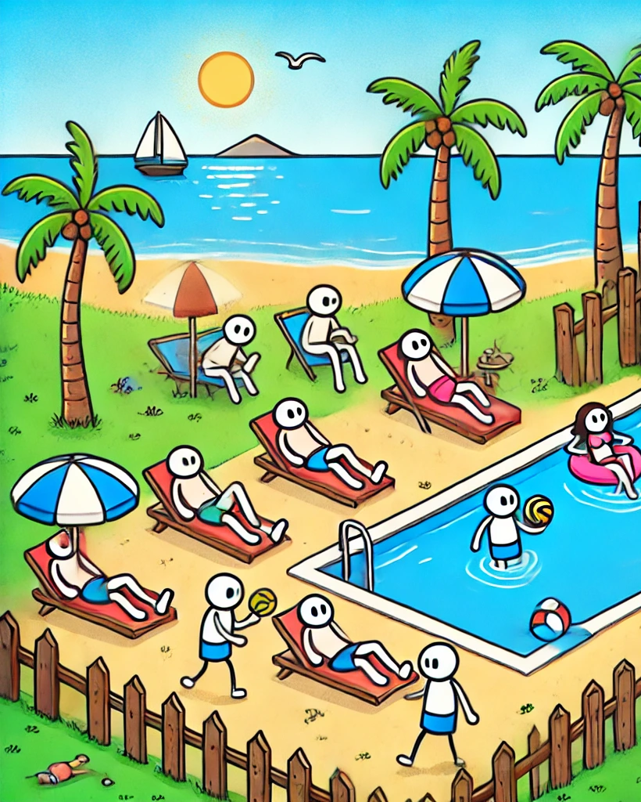
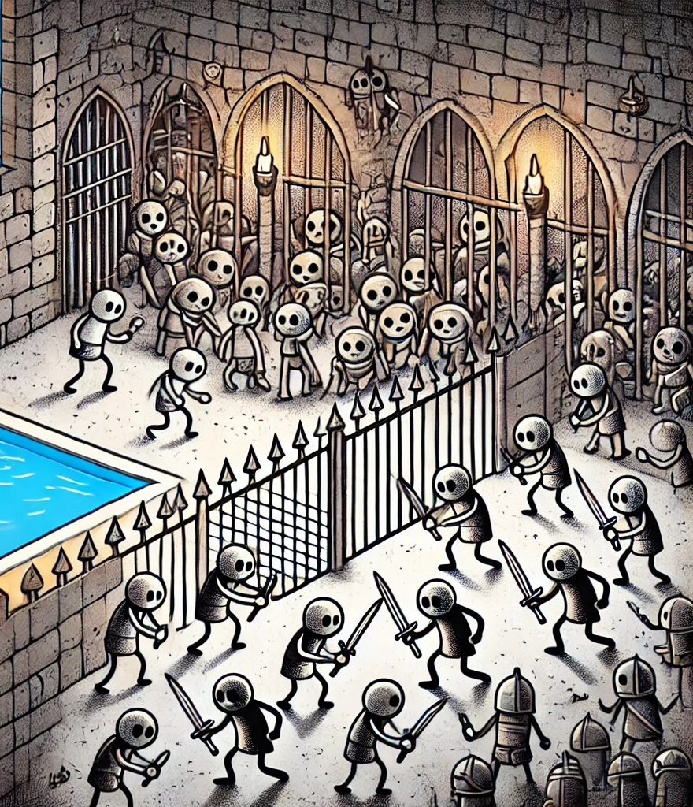
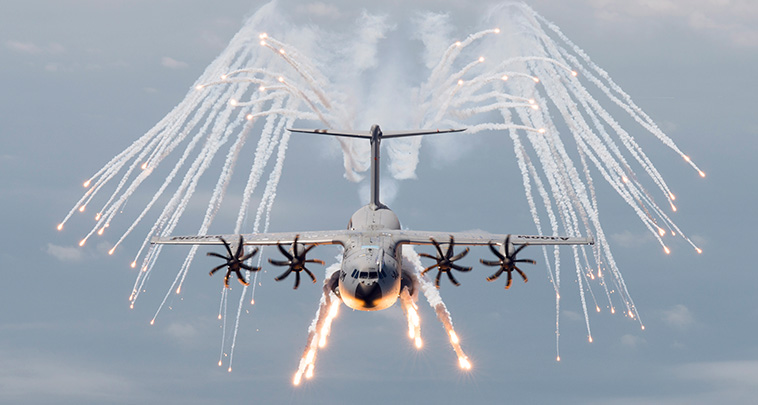
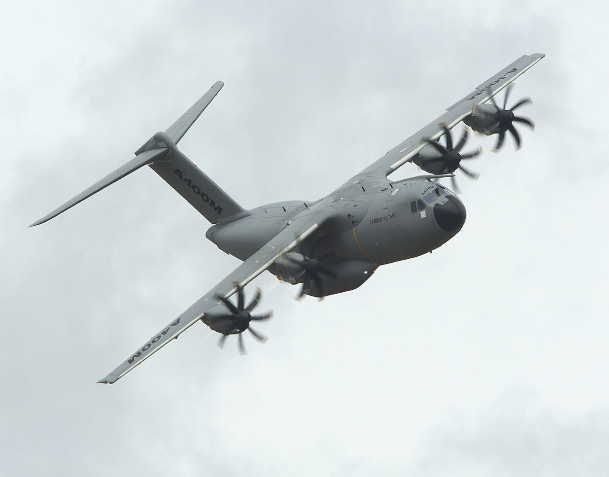
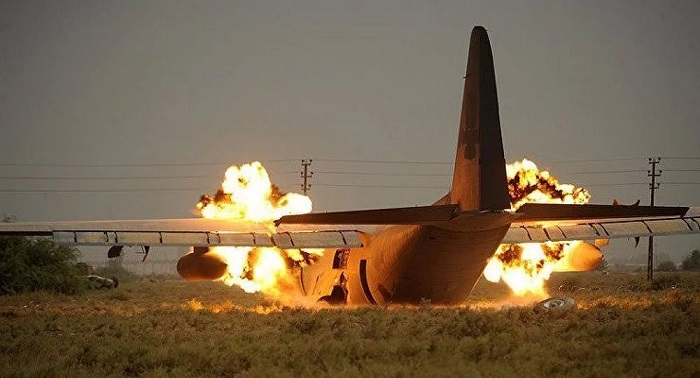
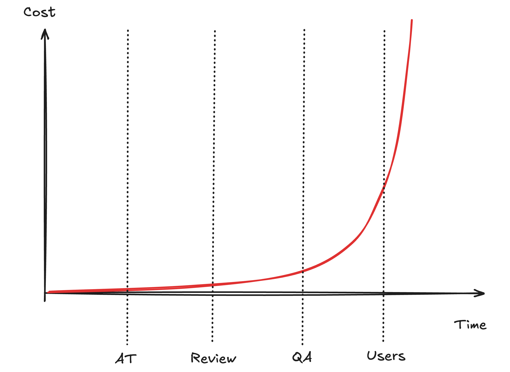

::right::

# "Le GRAAL"

---
layout: two-cols
class: text-center
---

# "La réalité"

::right::

---
layout: two-cols
---
# Les contre-mesures

<li v-click>Des tests automatisés</li>
<li v-click>Le code review</li>
<li v-click>Une QA</li>
<li v-click><s>Les utilisateurs</s></li>

 
 
 

### 
Comme l'avion ces contre-mesures sont lancés trop tard

 

### 
"Les bugs ont déjà été écris"

::right::

---
layout: two-cols
---

::title::
# Impacts des contre-mesures

::default::

::right::

---
layout: default
---

# Coûts des contre-mesures

