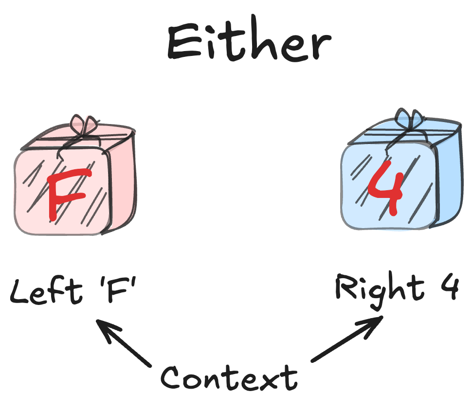
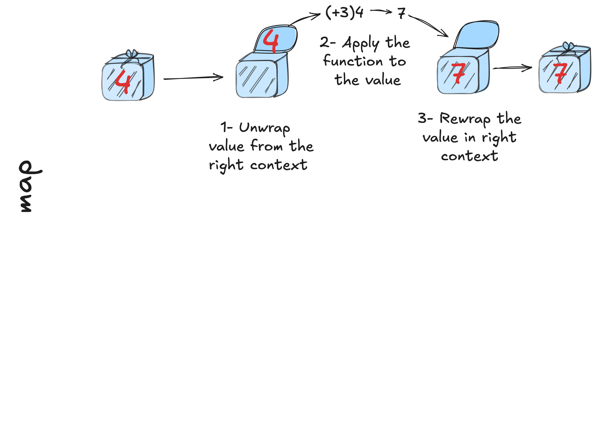
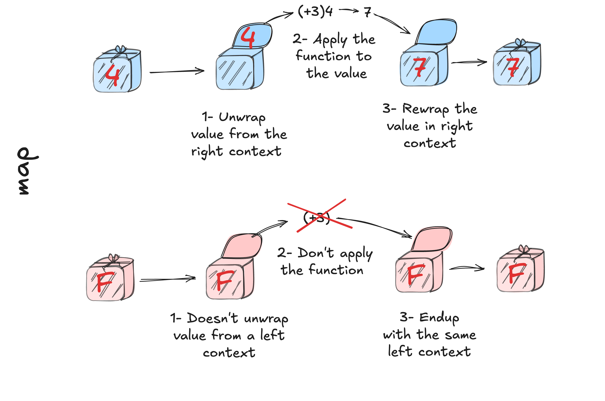

## Exception

````md magic-move {lines: true}

```dart {all}
WareHouse getWareHouse(String warehouseId) { ... }
  ... 
}
```
```dart {all}
WareHouse getWareHouse(WarehouseId warehouseId) { ... }
  if (wareHouses[wareHouseId] == null) {
    throw NotFoundError('Warehouse $warehouseId not found');
  }
  return wareHouses[wareHouseId];
}
```
```dart {all}
WareHouse getWareHouse(String warehouseId) { ... }

Widget computeDashboard(String warehouseId) {
  final WareHouse wareHouse = getWareHouse(warehouseId);
  ...
  return Dashboard(avgPrice: avgPrice);
}
```
```dart {all}
WareHouse getWareHouse(String warehouseId) { ... }

Widget computeDashboard(String warehouseId) {
  try {
    final WareHouse wareHouse = getWareHouse(warehouseId);
    ...
    return Dashboard(avgPrice: avgPrice);
  } catch (e) {
    logger.e('Failed to get warehouse', error: e);
    return ErrorPanel(
      'Can\'t find the specified warehouse. Please check the warehouse reference and retry',
    );
  }
}
```
````

---
layout: default
class: text-left
---


---
layout: default
class: text-left
---

## Exception 
<br/>
<v-switch>
  <template #1></template>
  <template #2></template>
  <template #3></template>
</v-switch>

---
layout: default
class: text-left
---

## Exception

````md magic-move {lines: true}
```dart {all}
WareHouse getWareHouse(WarehouseId warehouseId) { 
  ...
}
```
```dart {all}
Either<Error, WareHouse> getWareHouse(WarehouseId warehouseId) { 
  ...
}
```
```dart {all}
Either<Error, WareHouse> getWareHouse(WarehouseId warehouseId) { 
  if (wareHouses[warehouseId] == null) {
    return Left(NotFoundError('Warehouse $warehouseId not found'));
  }
  return Right(wareHouses[warehouseId]!);
}
```
```dart {all}
Either<Error, WareHouse> getWareHouse(WarehouseId warehouseId) { 
  return wareHouses[warehouseId] == null 
    ? Left(NotFoundError('Warehouse $warehouseId not found'))
    : Right(wareHouses[warehouseId]!);
}
```
```dart {all}
Either<Error, WareHouse> getWareHouse(WarehouseId warehouseId) { ... }

Widget computeDashboard(WarehouseId warehouseId) {
  getWareHouse(warehouseId);
}
```
```dart {all}
Either<Error, WareHouse> getWareHouse(WarehouseId warehouseId) { ... }

Widget computeDashboard(WarehouseId warehouseId) {
  getWareHouse(warehouseId)
    .map((warehouse) {
      ...
      return avgPrice;
    });
}
```
```dart {all}
Either<Error, WareHouse> getWareHouse(WarehouseId warehouseId) { ... }

Widget computeDashboard(WarehouseId warehouseId) {
  getWareHouse(warehouseId)
    .map(computeWareHouseAveragePrice);
}
```
```dart {all}
Either<Error, WareHouse> getWareHouse(WarehouseId warehouseId) { ... }

Widget computeDashboard(WarehouseId warehouseId) {
  return getWareHouse(warehouseId)
    .map(computeWareHouseAveragePrice);
}
```
```dart {6-9|7|8|all}
Either<Error, WareHouse> getWareHouse(WarehouseId warehouseId) { ... }

Widget computeDashboard(WarehouseId warehouseId) {
  return getWareHouse(warehouseId)
    .map(computeWareHouseAveragePrice)
    .fold(
      (error) => ErrorPanel('Can\'t find the specified warehouse'),
      (avgPrice) => Dashboard(avgPrice: avgPrice),
    );
}
```
```dart {1|7-10|all}
Either<WareHouseError, WareHouse> getWareHouse(WarehouseId warehouseId) { ... }

Widget computeDashboard(WarehouseId warehouseId) {
  return getWareHouse(warehouseId)
    .map(computeWareHouseAveragePrice)
    .fold(
      (error) => switch(error) {
        WarehouseNotFoundError() => ErrorPanel('Can\'t find the specified warehouse'),
        WareHouseClosedError() => ErrorPanel('The warehouse is closed'),
      },
      (avgPrice) => Dashboard(avgPrice: avgPrice),
    );
}
```
```dart {3-6|12|all}
Either<WareHouseError, WareHouse> getWareHouse(WarehouseId warehouseId) { ... }

Widget getWareHouseErrorPanel(WareHouseError error) => switch(error) {
  WarehouseNotFoundError() => ErrorPanel('Can\'t find the specified warehouse'),
  WareHouseClosedError() => ErrorPanel('The warehouse is closed'),
};

Widget computeDashboard(WarehouseId warehouseId) {
  return getWareHouse(warehouseId)
    .map(computeWareHouseAveragePrice)
    .fold(
      getWareHouseErrorPanel,
      (avgPrice) => Dashboard(avgPrice: avgPrice),
    );
}
```
```dart {all}
Either<WareHouseError, WareHouse> getWareHouse(WarehouseId warehouseId) { ... }

Widget getWareHouseErrorPanel(WareHouseError error) => switch(error) { ... }

Widget getDashboard(double avgPrice) => Dashboard(avgPrice: avgPrice);

Widget computeDashboard(WarehouseId warehouseId) {
  return getWareHouse(warehouseId)
    .map(computeWareHouseAveragePrice)
    .fold(
      getWareHouseErrorPanel,
      getDashboard,
    );
}
```
````

