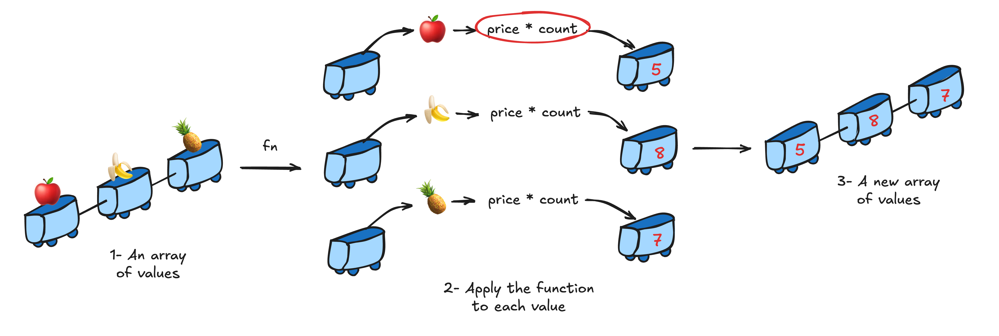

---
layout: default
class: text-left
---


# Imperatif vs Fonctionnel

<div v-click>
````md magic-move {lines: true}
```dart {all}
void main() {
  var fruits = [
    Fruit('🍎', FruitCategory.local, 10, 2.01),
    Fruit('🍌', FruitCategory.local, 5, 1.38),
    Fruit('🍍', FruitCategory.exotic, 4, 6.25),
  ];
  computeStockValue(fruits);
}

double computeStockValue(List<Fruit> fruits) {
  var total = 0.0;
  for (var i = 0; i < fruits.length; i++) {
    if (fruits[i].category == FruitCategory.local) {
      total += fruits[i].price * fruits[i].stock;
    }
  }
  return total;
}
```
````
</div>

#### <div v-click>On code le QUOI mais aussi le <span v-mark.circle.red="3">COMMENT</span></div>


---
layout: default
class: text-left
---


# Imperatif vs Fonctionnel


````md magic-move {lines: true}

```dart {all}
void main() {
  var fruits = [
    Fruit('🍎', FruitCategory.local, 10, 2.01),
    Fruit('🍌', FruitCategory.local, 5, 1.38),
    Fruit('🍍', FruitCategory.exotic, 4, 6.25),
  ];
  computeStockValueFP(fruits);
}

double computeStockValueFP(List<Fruit> fruits) =>
  ...
```

```dart {11}
void main() {
  var fruits = [
    Fruit('🍎', FruitCategory.local, 10, 2.01),
    Fruit('🍌', FruitCategory.local, 5, 1.38),
    Fruit('🍍', FruitCategory.exotic, 4, 6.25),
  ];
  computeStockValueFP(fruits);
}

double computeStockValueFP(List<Fruit> fruits) =>
  fruits;
```

```dart {12}
void main() {
  var fruits = [
    Fruit('🍎', FruitCategory.local, 10, 2.01),
    Fruit('🍌', FruitCategory.local, 5, 1.38),
    Fruit('🍍', FruitCategory.exotic, 4, 6.25),
  ];
  computeStockValueFP(fruits);
}

double computeStockValueFP(List<Fruit> fruits) =>
  fruits
    .where((fruit) => fruit.category == FruitCategory.local);
```

```dart {13}
void main() {
  var fruits = [
    Fruit('🍎', FruitCategory.local, 10, 2.01),
    Fruit('🍌', FruitCategory.local, 5, 1.38),
    Fruit('🍍', FruitCategory.exotic, 4, 6.25),
  ];
  computeStockValueFP(fruits);
}

double computeStockValueFP(List<Fruit> fruits) => 
  fruits
    .where((fruit) => fruit.category == FruitCategory.local)
    .map((fruit) => fruit.price * fruit.stock);
```

```dart {14|all}
void main() {
  var fruits = [
    Fruit('🍎', FruitCategory.local, 10, 2.01),
    Fruit('🍌', FruitCategory.local, 5, 1.38),
    Fruit('🍍', FruitCategory.exotic, 4, 6.25),
  ];
  computeStockValueFP(fruits);
}

double computeStockValueFP(List<Fruit> fruits) => 
  fruits
    .where((fruit) => fruit.category == FruitCategory.local)
    .map((fruit) => fruit.price * fruit.stock)
    .fold(0, (price1, price2) => price1 + price2);
```

````

#### <div v-click>On code <strong><span v-mark.circle.red="7">UNIQUEMENT</span></strong> le quoi !</div>

<div v-click="8">- <strong><span v-mark.line.red="9">Pas</span> de bug</strong></div>
<div v-click="10">- <strong><span v-mark.line.red="11">Moins</span> de charge cognitive (code linéaire)</strong></div>


---
layout: default
class: center
---

## Imperatif vs Fonctionnel
<br/>
<br/>

<v-switch>
  <template #1></template>
  <template #2></template>
  <template #3></template>
  <template #4></template>
</v-switch>


---
layout: default
class: text-left
---


# Imperatif vs Fonctionnel


````md magic-move {lines: true}

```dart {all}
void main() {
  var fruits = [
    Fruit('🍎', FruitCategory.local, 10, 2.01),
    Fruit('🍌', FruitCategory.local, 5, 1.38),
    Fruit('🍍', FruitCategory.exotic, 4, 6.25),
  ];
  computeStockValueFP(fruits);
}

double computeStockValueFP(List<Fruit> fruits) => 
  fruits
    .where((fruit) => fruit.category == FruitCategory.local)
    .map((fruit) => fruit.price * fruit.stock)
    .fold(0, (price1, price2) => price1 + price2);
```

```dart {10,14}
void main() {
  var fruits = [
    Fruit('🍎', FruitCategory.local, 10, 2.01),
    Fruit('🍌', FruitCategory.local, 5, 1.38),
    Fruit('🍍', FruitCategory.exotic, 4, 6.25),
  ];
  computeStockValueFP(fruits);
}

bool isLocalFruit(Fruit fruit) => fruit.category == FruitCategory.local;

double computeStockValueFP(List<Fruit> fruits) => 
  fruits
    .where(isLocalFruit)
    .map((fruit) => fruit.price * fruit.stock)
    .fold(0, (price1, price2) => price1 + price2);
```

```dart {11,16}
void main() {
  var fruits = [
    Fruit('🍎', FruitCategory.local, 10, 2.01),
    Fruit('🍌', FruitCategory.local, 5, 1.38),
    Fruit('🍍', FruitCategory.exotic, 4, 6.25),
  ];
  computeStockValueFP(fruits);
}

bool isLocalFruit(Fruit fruit) => fruit.category == FruitCategory.local;
double computePrice(Fruit fruit) => fruit.price * fruit.stock;

double computeStockValueFP(List<Fruit> fruits) => 
  fruits
    .where(isLocalFruit)
    .map(computePrice)
    .fold(0, (price1, price2) => price1 + price2);
```

```dart {12,18}
void main() {
  var fruits = [
    Fruit('🍎', FruitCategory.local, 10, 2.01),
    Fruit('🍌', FruitCategory.local, 5, 1.38),
    Fruit('🍍', FruitCategory.exotic, 4, 6.25),
  ];
  computeStockValueFP(fruits);
}

bool isLocalFruit(Fruit fruit) => fruit.category == FruitCategory.local;
double computePrice(Fruit fruit) => fruit.price * fruit.stock;
double sum(double price1, double price2) => price1 + price2;

double computeStockValueFP(List<Fruit> fruits) => 
  fruits
    .where(isLocalFruit)
    .map(computePrice)
    .fold(0, sum);
```

```dart
void main() {
  var fruits = [
    Fruit('🍎', FruitCategory.local, 10, 2.01),
    Fruit('🍌', FruitCategory.local, 5, 1.38),
    Fruit('🍍', FruitCategory.exotic, 4, 6.25),
  ];
  computeStockValueFP(fruits);
}

bool isLocalFruit(Fruit fruit) => fruit.category == FruitCategory.local;
double computePrice(Fruit fruit) => fruit.price * fruit.stock;
double sum(double price1, double price2) => price1 + price2;

double computeStockValueFP(List<Fruit> fruits) => 
  fruits
    .where(isLocalFruit)
    .map(computePrice)
    .fold(0, sum);
```

````

<div v-click="5">- <strong><span v-mark.line.red="6">Testable</span></strong></div>
<div v-click="7">- <strong><span v-mark.line.red="8">Réutilisable</span></strong></div>


