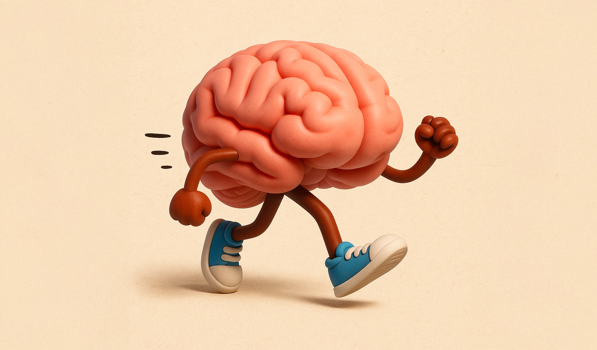

# Qui suis-je ?

## Tech Lead Flutter à DigitRE Group

 
 

#### Exp. > 30 ans
#### Fullstack avec beaucoup de backend
#### Adepte de SOLID

 

#### Et je DETESTE les bugs

---
layout: two-cols
class: text-center
---
::title::
# Mon ressenti fasse aux bugs
::default::

::right::

---
layout: two-cols
class: text-left
---

::title::
# Les responsables

::default::

::right::

---
layout: intro
class: text-center
---

# Le charge cognitive

## « La charge cognitive correspond à la quantité de ressources cognitives investies par un individu lors de la réalisation d’une tâche »
