## Nullability

````md magic-move {lines: true}
```dart {all}

double averagePrice(List<Fruit> fruits) =>
  fruits
    .map(fruitToPrice)
    .fold(0, sum) / fruits.length;
```
```dart {all}

double averagePrice(List<Fruit> fruits) =>
  fruits.isNotEmpty ? fruits
    .map(fruitToPrice)
    .fold(0, sum) / fruits.length : 0;
```
```dart {all}
double? averagePrice(List<Fruit> fruits) =>
  fruits.isNotEmpty ? fruits
    .map(fruitToPrice)
    .fold(0, sum) / fruits.length : null;
```
```dart {all}
MyType? myVal
```
```dart {all}
MyVal? myVal;
myVal?.doSomething();
```
```dart {all}
MyType? myVal;
myVal?.doSomething();
if (myVal != null) {
   myVal.doSomething();
}
```
```dart {all}
MyType? myVal;
myVal?.doSomething();
if (myVal != null) {
   myVal.doSomething();
}
if (myVal != null) {
   myVal!.getSomething();
}
```
```dart {all}
MyType? myVal;
myVal?.doSomething();
if (myVal != null) {
   myVal.doSomething();
}
if (myVal != null) {
   myVal!.getSomething();
}
myVal?.getSomething() ?? defaultValue;
```
```dart {all}
MyType? myVal;
myVal?.doSomething();
if (myVal != null) {
   myVal.doSomething();
}
if (myVal != null) {
   myVal!.getSomething();
}
myVal?.getSomething() ?? defaultValue;
[
  ?myVal.someValue,
]
```
```dart {all}
Widget computeDashboard(String warehouseId) {
    final List<Fruit>? fruits = getFruits(warehouseId);
    if (fruits == null) {
        return EmptyDashboard();
    }
    final double? avgPrice = averagePrice(fruits);
    return Dashboard(avgPrice);
}
```
```dart {all}
Widget computeDashboard(String warehouseId) {
    final Stocks? stocks = getStocks(warehouseId);
    if (stocks == null) {
        return EmptyDashboard();
    }
    final List<Fruit>? fruits = getFruits(stocks);
    if (fruits == null) {
        return EmptyDashboard();
    }
    final double? avgPrice = averagePrice(fruits);
    if (avgPrice == null) {
        return EmptyDashboard();
    }
    return Dashboard(avgPrice);
}
```
````

---
layout: two-cols
class: text-left
hide: true
---

::title::
## Nullability

::default::
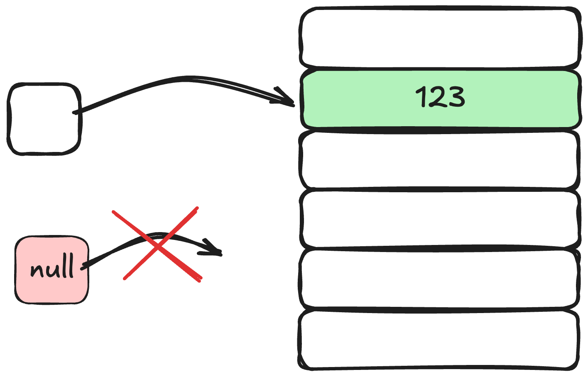

::right::

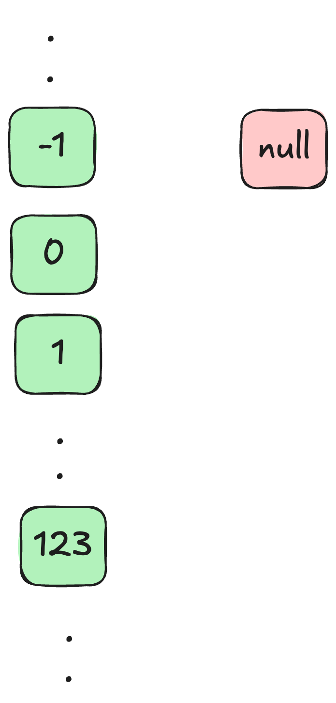


---
layout: default
class: text-left
---

## Nullability


---
layout: default
class: text-center
---

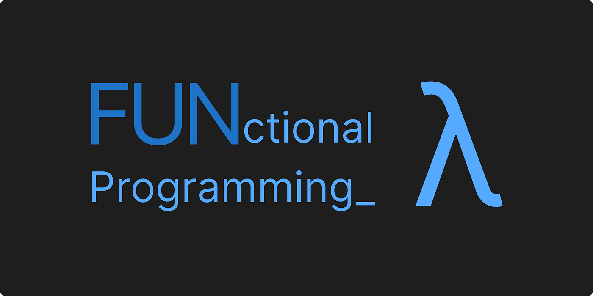

---
layout: default
class: text-left
---

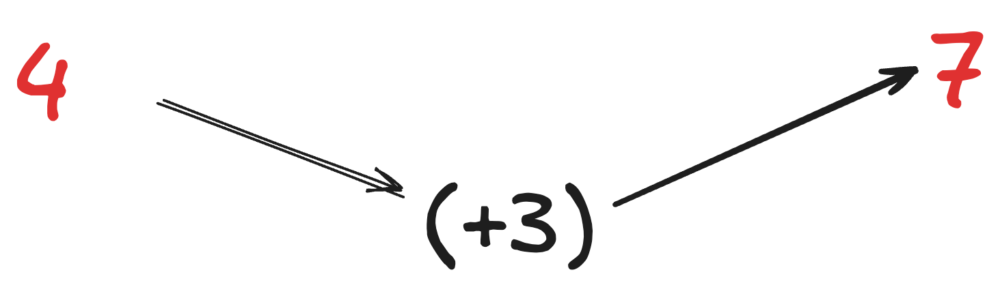
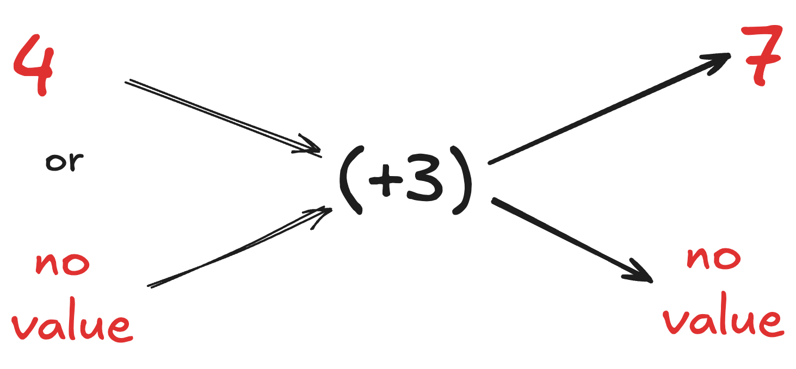

---
layout: two-cols
class: text-left
---

::default::
<br/>
<br>
<br>
<br>
<br>
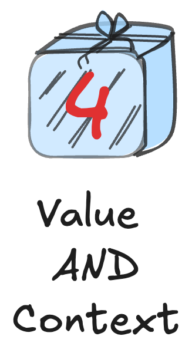

::right::
<br/>
<br>
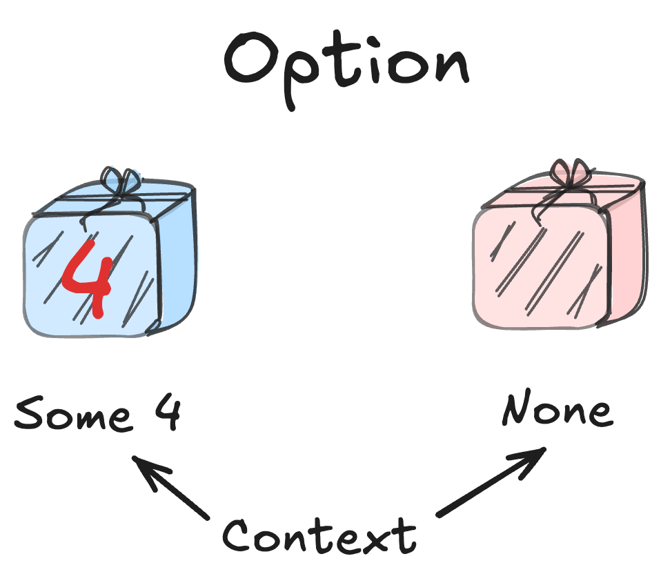


---
layout: default
class: text-left
---


---
layout: default
class: text-left
---

## Option
<br/>
<br/>
<br/>
<br/>
<v-switch>
  <template #1></template>
  <template #2>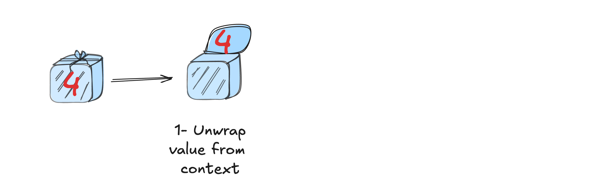</template>
  <template #3>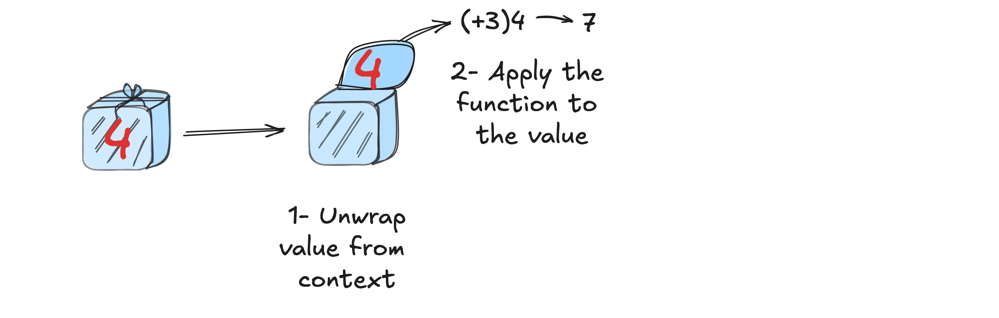</template>
  <template #4>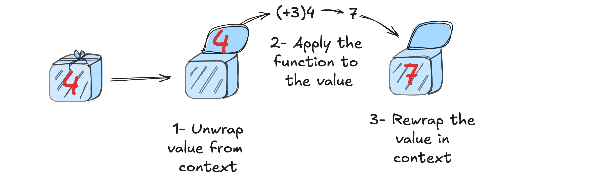</template>
  <template #5>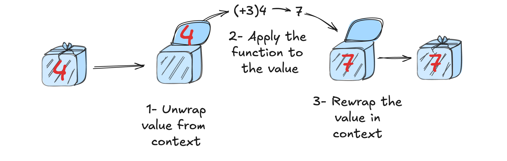</template>
</v-switch>


---
layout: default
class: text-left
---

## Option
<br/>
<br/>
<br/>
<br/>
<v-switch>
  <template #1></template>
  <template #2>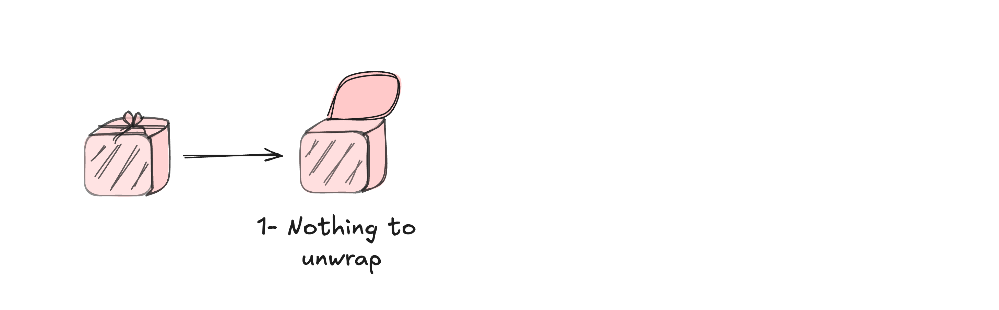</template>
  <template #3>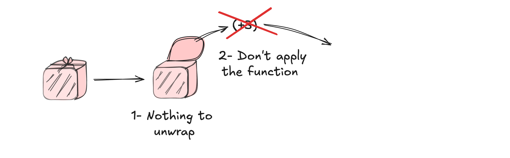</template>
  <template #4>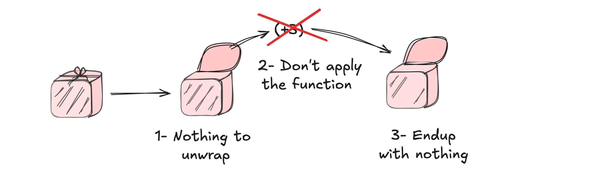</template>
  <template #5>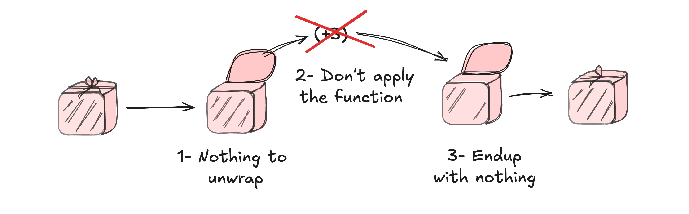</template>
</v-switch>


---
layout: default
class: text-left
---

## Option

````md magic-move {lines: true}

```dart {all}
double? averagePrice(List<Fruit> fruits) =>
  fruits.isNotEmpty ? fruits
    .map(fruitToPrice)
    .fold(0, sum) / fruits.length : null;
```
```dart {all}
Option<double> averagePrice(List<Fruit> fruits) =>
  fruits.isNotEmpty 
    ? Some(fruits
      .map(fruitToPrice)
      .fold(0, sum) / fruits.length) 
    : None();
```
```dart {all|1,5|6|3,7-10}
Option<double> averagePrice(List<Fruit> fruits) { ... }

Widget computeDashboard(String warehouseId) {
    ...
    final Option<double> avgPrice = averagePrice(fruits);
    final Option<double> ttcPrice = avgPrice.map((price) => price * 1.2);
    return ttcPrice.match(
      () => EmptyDashboard(),
      (value) => Dashboard(value),
    );
}
```
```dart {all}
Option<double> averagePrice(List<Fruit> fruits) { ... }

Widget computeDashboard(String warehouseId) {
    ...
    return averagePrice(fruits)
      .map((price) => price * 1.2)
      .match(
        () => EmptyDashboard(),
        (value) => Dashboard(price: value),
      );
}
```
```dart {all}
Option<double> averagePrice(List<Fruit> fruits) { ... }
double Function(double) addTva(double tax) { ... }

Widget computeDashboard(String warehouseId) {
    ...
    return averagePrice(fruits)
      .map(addTva(1.2))
      .match(
        () => EmptyDashboard(),
        (value) => Dashboard(price: value),
      );
}
```
```dart {1,7|1,2,8|3,9|4,10|11-14}
Option<Stocks> getStocks(String warehouseId) { ... }
List<Fruit> getFruits(Stocks stocks) { ... }
Option<double> averagePrice(List<Fruit> fruits) { ... }
double Function(double) addTva(double tax) { ... }

Widget computeDashboard(String warehouseId) {
    return getStocks(warehouseId)
      .map(getFruits)
      .flatMap(averagePrice)
      .map(addTva(1.2))
      .match(
        () => EmptyDashboard(),
        (ttcAvgPrice) => Dashboard(ttcAvgPrice),
      );
}
```
````

---
layout: two-cols
class: text-left
---

::title::
## Option

::default::

```dart {all}
Widget computeDashboard(String warehouseId) {
    final Stocks? stocks = getStocks(warehouseId);
    if (stocks == null) {
        return EmptyDashboard();
    }
    final List<Fruit>? fruits = getFruits(stocks);
    if (fruits == null) {
        return EmptyDashboard();
    }
    final double? avgPrice = averagePrice(fruits);
    if (avgPrice == null) {
      return EmptyDashboard();
    }
    final double ttcAvgPrice = addTva(avgPrice);
    return Dashboard(ttcAvgPrice);
}
```

::right::
````md magic-move {lines: false}

```dart {all}
Widget computeDashboard(String warehouseId) =>
  getStocks(warehouseId)
    .map(getFruits)
    .flatMap(averagePrice)
    .map(addTva(1.2))
    .match(
      () => EmptyDashboard(),
      (ttcAvgPrice) => Dashboard(ttcAvgPrice),
    );

```
````


